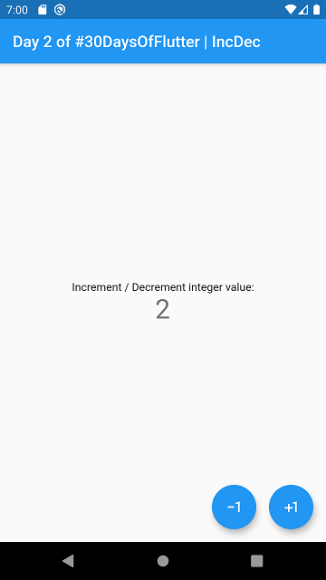
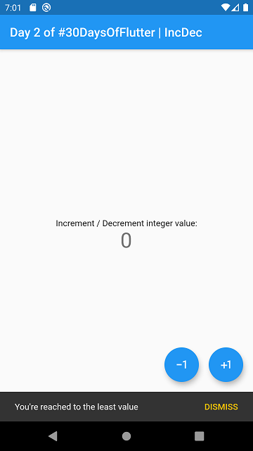

# day_02

day_02 an app demonstrating the use case of `setState` method and to implement increment / decrement functionality by using it. This app is simply modified few lines of code and changes some text in `Text` Widget. The primary goal is to demonstrate the power of `Flutter`. Since almost everything is widget, we have the full control over the app, from its design to its functionalities.

There's a lots of ways to do it, But I chose the simple one.

### Here's some screenshots

 

