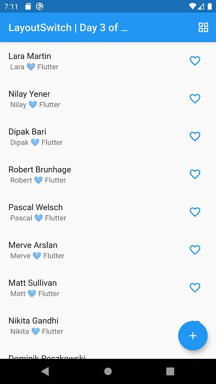
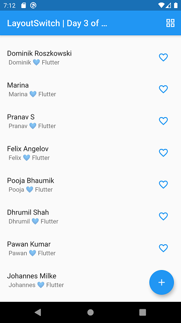
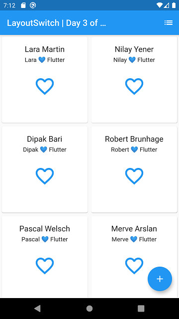
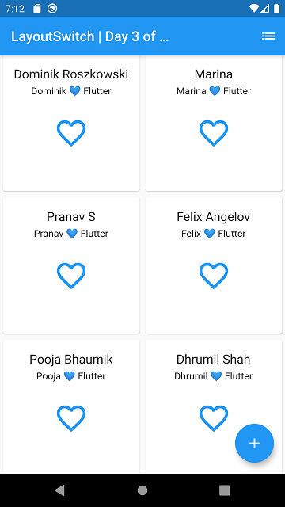
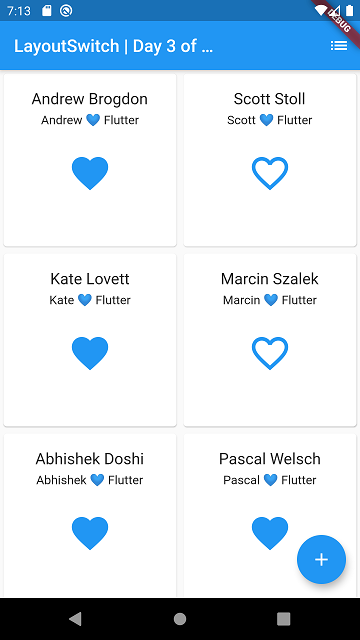
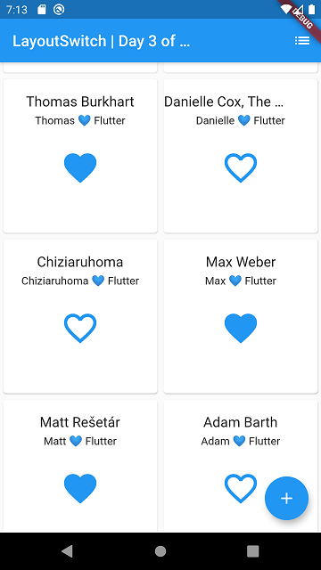

# day_03

day_03 an app that demonstrates to switch between two `Layout`s of Flutter using `action` and It uses `AlertDialog` to add new members.

Well, while developing I chose again to do make it as easy as I can. But, sometimes I felt I didn't wanted to stop myself for going further. 😂😄💙

Mainly, used `ListView` and `GridView` as **Parent Layout** (body). 

### Here's some screenshots

