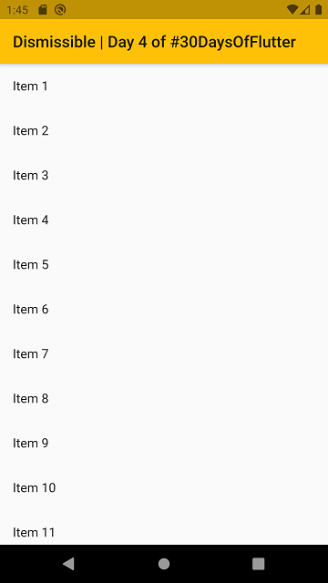
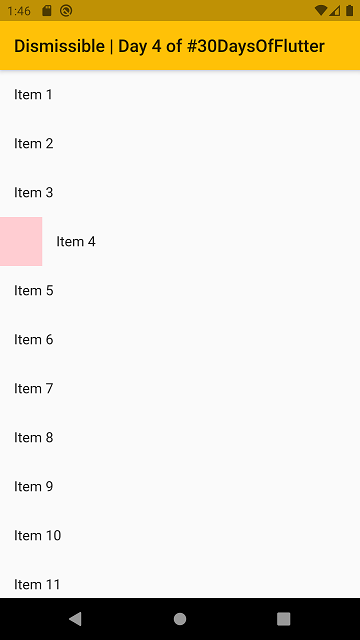
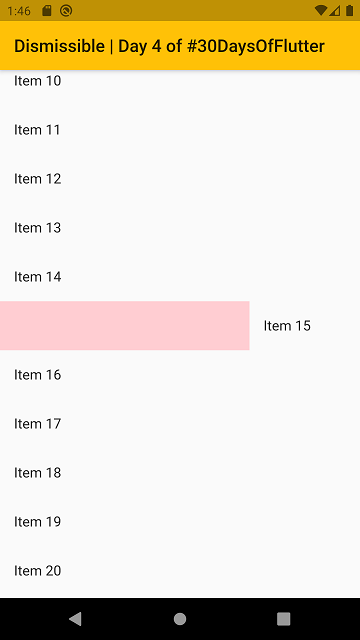
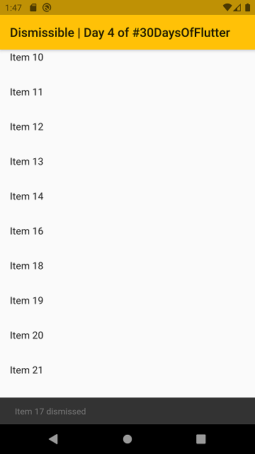
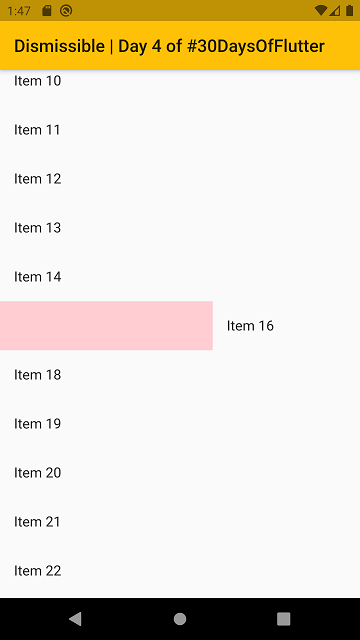
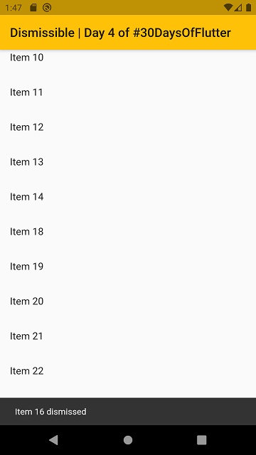
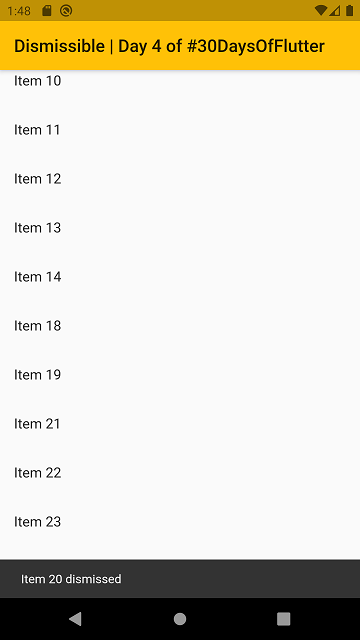

# day_04

day_04 an app that uses the `Dismissible` Widget for `ListView`. It's generally works with `onDismissed` where we give the code to remove a single **item** from the **list** we have. For this demonstration I ignored the `direction` checking step. 

Since, we're making changes on screen. So, in this case we need to use `Stateful Widget` to maintain / propagate to the new `State` of the `HomePage`.

### Here's some screenshots

