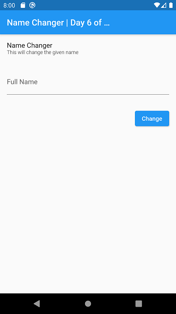
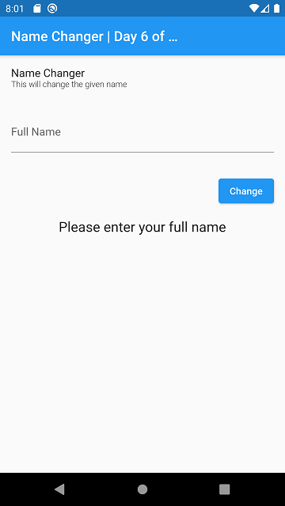
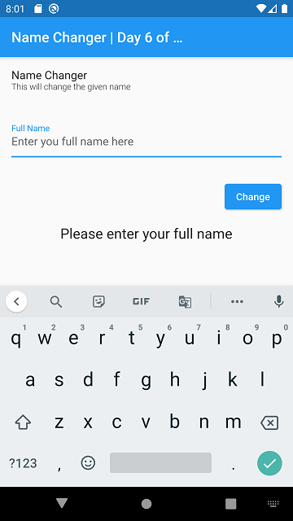
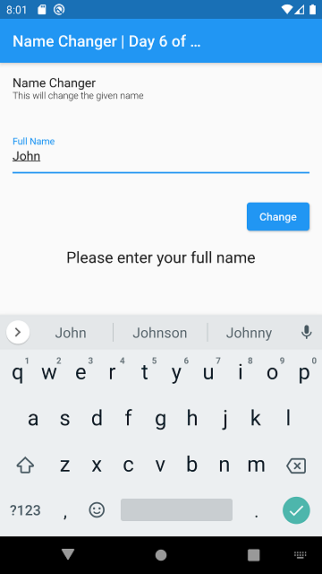
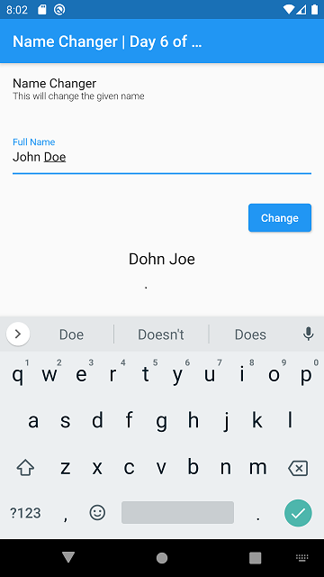

# day_06

day_06 an app that deals with the basic component/`widgets` like `TextFormField`, `Text`, `Button`, `Rows & Columns`, and `Container` etc. The purpose for making this app to demonstrate the `String` manipulation and using the some basic possibilities to achieve a simple goal.

In this app we need to give the user's fullname (i.e., Firstname and the Lastname) and it just replace the firstname first index charact with last name first index character [vice-versa].

**Note:** *There was no intention to make this app to ruin names.* 😂 If it does then please excuse me.

### Here's some screenshots

