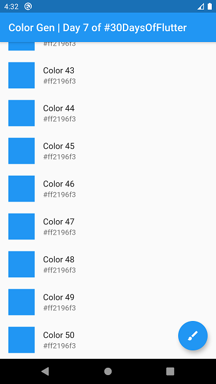
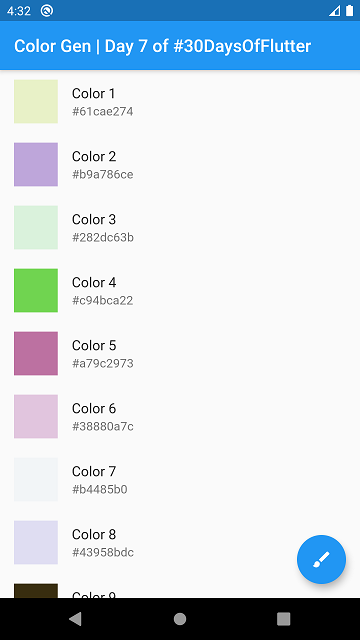
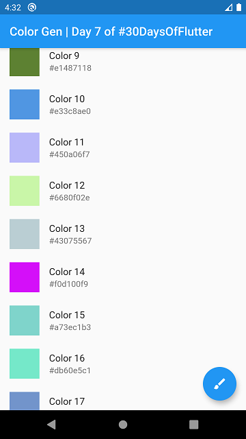
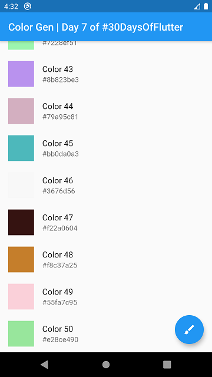
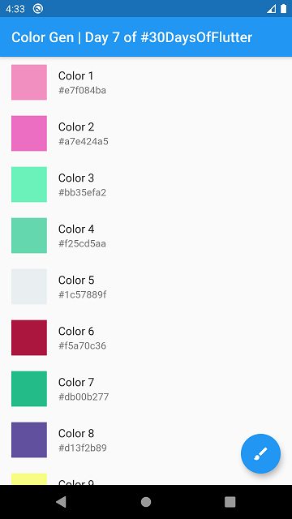
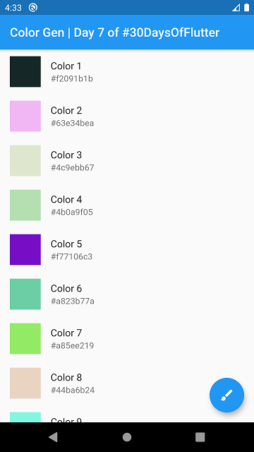
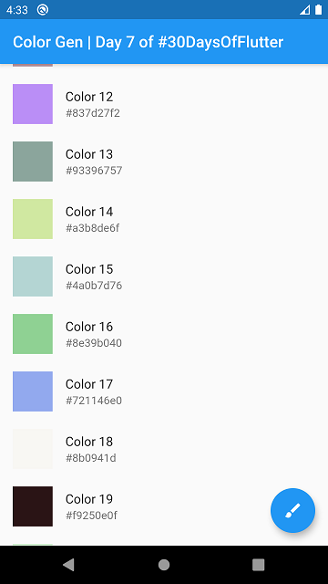
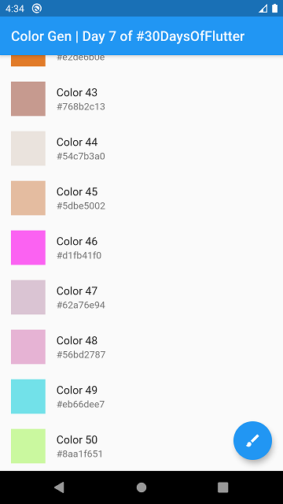

# day_07

day_07 an app that demonstrate the implementation of `ListView` widget using the `builder()` method. The concept is very simple and straight forward, we gonna change the `leading` portion of the `ListTile` widget when `FloatingActionButton` will pressed. Initially all the `leading` will have the same color until the `FloatingActionButton` press which generates the `Random` colors for the `leading` element.

It's Sunday means fun day. Let's have some fun with `Flutter` and its `Widget`. 😁

You can modify it by your own version as you like to have specific output. Well I could do more stuffs with it. But not gonna to do that ¯\\_(ツ)_/¯

### Here's some screenshots

