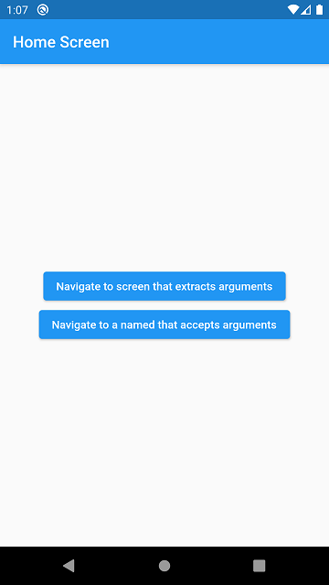
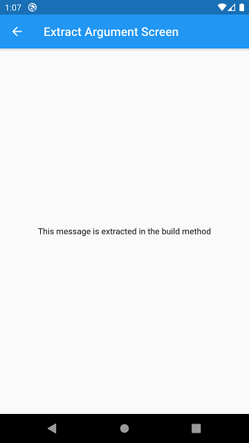
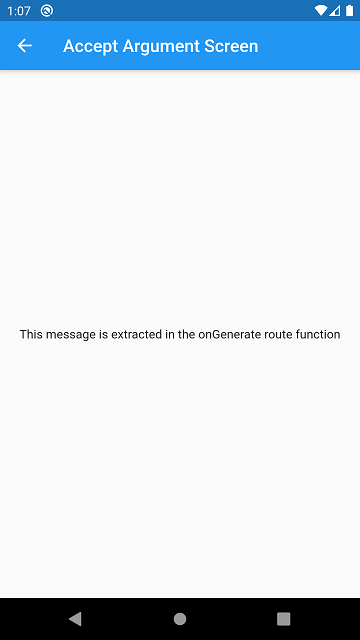

# day_08
## app_3

app_3 an app that demonstrates the way of passing data through arguments using `Navigator` Or, simply say Navigating Screen with Arguments. 

Basically, there are some steps that I've followed up from the Flutter's official documentation to achieve the goal. Here's the following steps...

1. Define the arguments you need to pass.
2. Create a widget that extracts the arguments.
3. Register the widget in the routes table.
4. Navigate to the widget.

Note: This example is taken from the official Flutter Documentation of [Navigation Part | Cookbook](https://flutter.dev/docs/cookbook/navigation/navigate-with-arguments)

### Here's some Screenshots

