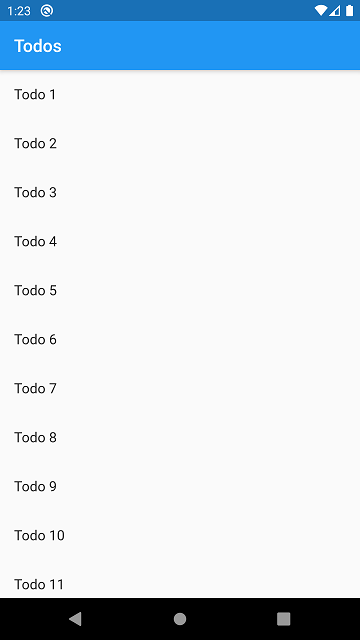
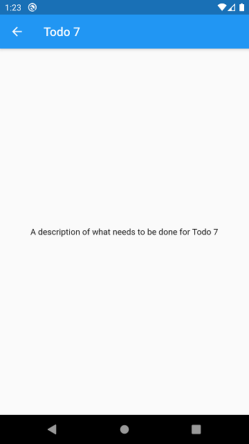
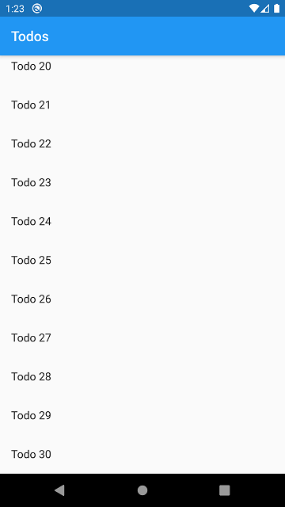

# day_08
## app_4

app_4 an app that demonstrate the method to pass data by using `Navigator.push(context, route)` from the `ListView`. For this example we used `Todo` model where we'll get the title and the description of each todos.

Note: This example is taken from the official Flutter Documentation of [Navigation Part | Cookbook](https://flutter.dev/docs/cookbook/navigation/passing-data)

### Here's some Screenshots

