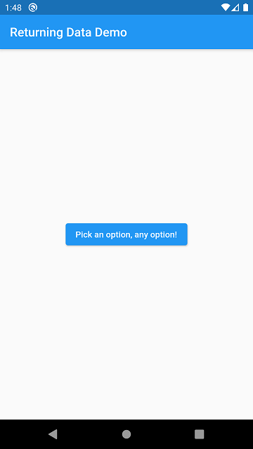
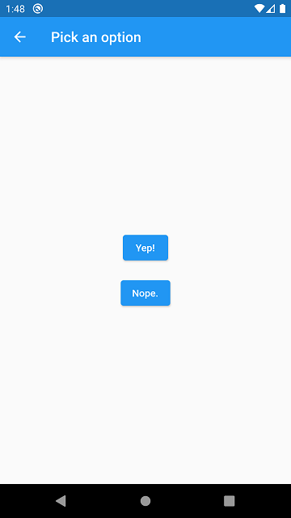
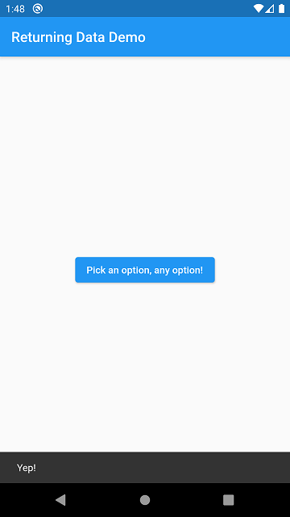

# day_08
## app_5

app_5 an app that demonstrates the method to get data from the another screen to the main screen by using `Navigator.push(context, route)` and `Navigator.pop(context)` methods.

I followed the some easy steps from the Flutter's official documentation. Here's they are...

1. Define the home screen
2. Add a button that launches the selection screen
3. Show the selection screen with two buttons
4. When a button is tapped, close the selection screen
5. Show a snackbar on the home screen with the selection

Note: This example is taken from the official Flutter Documentation of [Navigation Part | Cookbook](https://flutter.dev/docs/cookbook/navigation/returning-data)

### Here's some Screenshots

