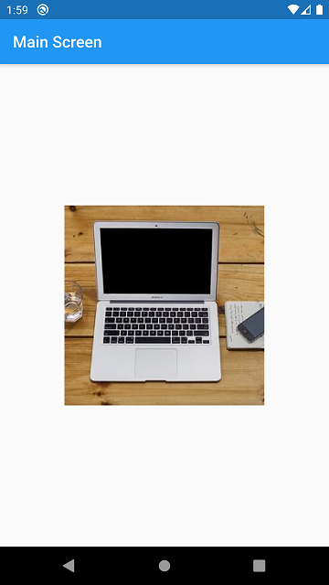
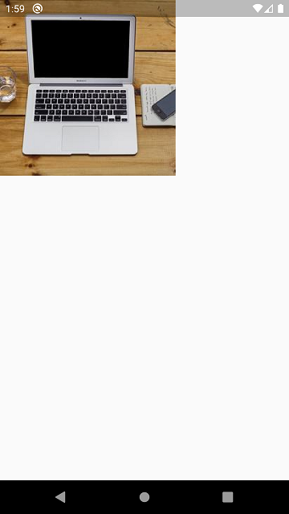

# day_08
## app_6

app_6 an app that demonstrates the basic transition animation between two screens using `Hero` Widget. The concept is simple all we need to do to create two screen and making the image resource same and we need to pass the `tag` in `Hero` widget.

Note: This example is taken from the official Flutter Documentation of [Navigation Part | Cookbook](https://flutter.dev/docs/cookbook/navigation/hero-animations)

### Here's some Screenshots

 &nbsp; &nbsp; 